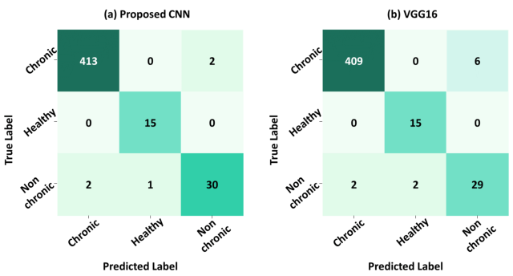

# A Lightweight CNN Model for Detecting Respiratory Diseases from Lung Auscultation Sounds using EMD-CWT-based Hybrid Scalogram
### *Published in IEEE JBHI*, [arXiv link](https://arxiv.org/pdf/2009.04402.pdf)

**Objective:** Listening to lung sounds through auscultation is vital in examining the respiratory system for abnormalities. Automated analysis of lung auscultation sounds can be beneficial to the health systems in low-resource settings where there is a lack of skilled physicians. In this work, we propose a lightweight convolutional neural network (CNN) architecture to classify respiratory diseases using hybrid scalogram-based features of lung sounds. The hybrid scalogram features utilize the empirical mode decomposition (EMD) and continuous wavelet transform (CWT).The proposed scheme’s performance is studied using a patient independent train-validation set from the publicly available ICBHI 2017 lung sound dataset. 


**Data:** 
ICBHI (International Conference on Biomedical Health
Informatics) 2017 database is a publicly available benchmark dataset of lung auscultations. It is collected by two independent research teams of Portugal and Greece. The dataset contains 5.5 hours of audio recordings sampled at different frequencies (4 kHz, 10 kHz, and 44.1 kHz), ranging from 10s to 90s, in 920 audio samples of 126 subjects from different anatomical positions with heterogeneous equipment.Link to dataset from Kaggle: https://www.kaggle.com/vbookshelf/respiratory-sound-database


**CNN Architecture:**
Used the processed and saved scalogram as inputs to Convolutional Neural Network with the following network architecture to classify the respiratory data:


**Results:**
Employing the proposed framework, weighted accuracy scores of 99.20% for ternary chronic classification and 99.05% for six-class pathological classification are achieved, which outperform well-known and much larger VGG16 in terms of accuracy by 0.52% and 1.77% respectively. The proposed CNN model also outperforms other contemporary lightweight models while being computationally comparable.




**Citation:** 
If you use the code in your paper, then please cite it as:
```
@article{shuvo2020lightweight,
  title={A lightweight cnn model for detecting respiratory diseases from lung auscultation sounds using emd-cwt-based hybrid scalogram},
  author={Shuvo, Samiul Based and Ali, Shams Nafisa and Swapnil, Soham Irtiza and Hasan, Taufiq and Bhuiyan, Mohammed Imamul Hassan},
  journal={IEEE Journal of Biomedical and Health Informatics},
  year={2020},
  publisher={IEEE}
}


